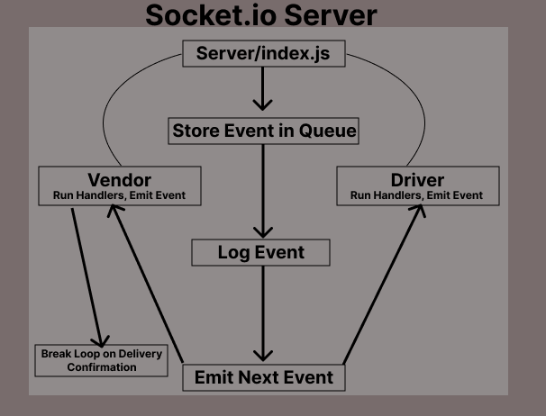

# caps (LAB 13)

## Code Academy Parcel Service (Supply Chain Simulator)

### Author: Tyler Bennett

### Problem Domain  

Simulate Package Delivery with Event Driven Development and Message Queue

### Links and Resources

- [ci/cd](https://github.com/tyler-bennett52/caps/actions) (GitHub Actions)

### Setup

#### `.env` requirements (where applicable)

PORT environment variable

#### How to initialize/run your application (where applicable)

- A bit more complicated than usual. Split a terminal in 4 parts running: 1. server/index.js 2. clients/widget-vendor/handler.js 3. clients/flower-vendor/handler.js 4. clients/driver/handler.js

#### How to use your library (where applicable)

#### Features / Routes

Simulates a loop of packages being delivered with events on a cycle of 5 seconds. Loop begins when running `node hub.js`

#### Tests

fill this in as you see fit

- How do you run tests? -  npm test

- I don't think my tests are working correctly. They pass but I had to comment out the section where I create mock functions and that seems strange to me. The description below is mostly for me when I come back to this tomorrow.

 Tests don't seem to like the socket/io requires in the handler files. I tried refactoring to courier functions, leaving the socket creation in index.js rather than handler. I wasn't able to get the socket passed into the courier function correctly and because the refactor was breaking more stuff I just rolled back to my last commit.

#### UML

#### Attribution

Relied on class demo for general structure and refactor to socket.io, doubly so for the implementation of message queues.
