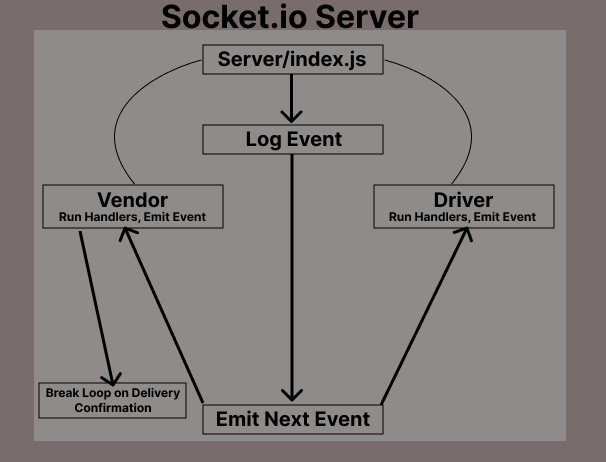

# caps (LAB 12)

## Code Academy Parcel Service (Supply Chain Simulator)

### Author: Tyler Bennett

### Problem Domain  

Simulate Package Delivery with Event Driven Development and Socket.io

### Links and Resources

- [ci/cd](https://github.com/tyler-bennett52/caps/actions) (GitHub Actions)

### Setup

#### `.env` requirements (where applicable)

PORT environment variable

#### How to initialize/run your application (where applicable)

- `node hub.js`

#### How to use your library (where applicable)

#### Features / Routes

Simulates a loop of packages being delivered with events on a cycle of 5 seconds. Loop begins when running `node hub.js`

#### Tests

fill this in as you see fit

- How do you run tests? -  npm test

#### UML

#### Attribution

Relied on class demo for general structure and refactor to socket.io
